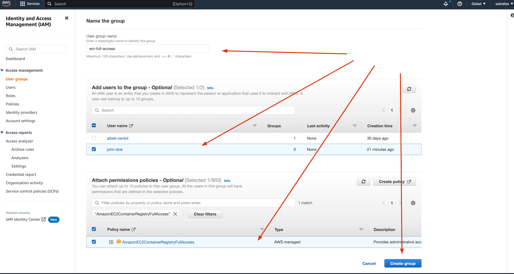

# How to deploy to the AWS EC2 server
- [How to deploy to the AWS EC2 server](#how-to-deploy-to-the-aws-ec2-server)
  - [create the AWS EC2 server](#create-the-aws-ec2-server)
    - [install Docker](#install-docker)
      - [Executing the Docker Command Without Sudo (Optional)](#executing-the-docker-command-without-sudo-optional)
      - [Running NGINX Open Source in a Docker Container](#running-nginx-open-source-in-a-docker-container)
    - [Installing the latest version of the AWS CLI](#installing-the-latest-version-of-the-aws-cli)
    - [Create the ECR repository](#create-the-ecr-repository)
      - [Create the IAM user credentials](#create-the-iam-user-credentials)
      - [Creating the User Groups](#creating-the-user-groups)
- [Create a new Nest.JS project](#create-a-new-nestjs-project)
      - [Generate new project using nest cli](#generate-new-project-using-nest-cli)
      - [GitHub Action configuration](#github-action-configuration)

## create the AWS EC2 server 
here will be a link to the video
https://prnt.sc/b1hmlOzOFP1S

### install Docker
First, update your existing list of packages:
```bash
sudo apt update
```
Next, install a few prerequisite packages which let apt use packages over HTTPS:
```bash
sudo apt install apt-transport-https ca-certificates curl software-properties-common
```
Then add the GPG key for the official Docker repository to your system:
```bash
curl -fsSL https://download.docker.com/linux/ubuntu/gpg | sudo apt-key add -
```
Add the Docker repository to APT sources:
```bash
sudo add-apt-repository "deb [arch=amd64] https://download.docker.com/linux/ubuntu focal stable"
```
This will also update our package database with the Docker packages from the newly added repo.

Make sure you are about to install from the Docker repo instead of the default Ubuntu repo:
```bash
apt-cache policy docker-ce
```
You’ll see output like this, although the version number for Docker may be different:
```bash
# Output of apt-cache policy docker-ce
docker-ce:
  Installed: (none)
  Candidate: 5:19.03.9~3-0~ubuntu-focal
  Version table:
     5:19.03.9~3-0~ubuntu-focal 500
        500 https://download.docker.com/linux/ubuntu focal/stable amd64 Packages
```
Notice that `docker-ce` is not installed, but the candidate for installation is from the Docker repository for Ubuntu 20.04 (focal).

Finally, install Docker:
```bash
sudo apt install docker-ce
```
Docker should now be installed, the daemon started, and the process enabled to start on boot. Check that it’s running:
```bash
sudo systemctl status docker
```

The output should be similar to the following, showing that the service is active and running:
```bash
Output
● docker.service - Docker Application Container Engine
     Loaded: loaded (/lib/systemd/system/docker.service; enabled; vendor preset: enabled)
     Active: active (running) since Tue 2020-05-19 17:00:41 UTC; 17s ago
TriggeredBy: ● docker.socket
       Docs: https://docs.docker.com
   Main PID: 24321 (dockerd)
      Tasks: 8
     Memory: 46.4M
     CGroup: /system.slice/docker.service
             └─24321 /usr/bin/dockerd -H fd:// --containerd=/run/containerd/containerd.sock
```
Installing Docker now gives you not just the Docker service (daemon) but also the docker command line utility, or the Docker client. We’ll explore how to use the docker command later in this tutorial.

#### Executing the Docker Command Without Sudo (Optional)
By default, the docker command can only be run the root user or by a user in the docker group, which is automatically created during Docker’s installation process. If you attempt to run the docker command without prefixing it with sudo or without being in the docker group, you’ll get an output like this:
```bash
# Output
docker: Cannot connect to the Docker daemon. Is the docker daemon running on this host?.
See 'docker run --help'.
```
If you want to avoid typing sudo whenever you run the docker command, add your username to the docker group:
```bash
sudo usermod -aG docker ${USER}
```

To apply the new group membership, **log out of the server and back in**, or type the following:
```bash
su - ${USER}
```
You will be prompted to enter your user’s password to continue.
Confirm that your user is now added to the docker group by typing:
```bash
groups
# Output
ubuntu adm dialout cdrom floppy sudo audio dip video plugdev netdev lxd docker
```
If you need to add a user to the docker group that you’re not logged in as, declare that username explicitly using:
```bash
sudo usermod -aG docker ${USER}
```
The rest of this article assumes you are running the docker command as a user in the docker group. If you choose not to, please prepend the commands with sudo.

Let’s explore the docker command next.
```bash
docker info
```
#### Running NGINX Open Source in a Docker Container
You can create an NGINX instance in a Docker container using the NGINX Open Source image from the Docker Hub.
1. Launch an instance of NGINX running in a container and using the default NGINX configuration with the following command:

```bash
docker run --rm --name mynginx1 -p 80:80 -d nginx
```
where:
- the -rm option tells Docker to remove the container after stop
- mynginx1 is the name of the created container based on the NGINX image

- the -d option specifies that the container runs in detached mode: the container continues to run until stopped but does not respond to commands run on the command line.

- the -p option tells Docker to map the ports exposed in the container by the NGINX image (port 80) to the specified port on the Docker host. The first parameter specifies the port in the Docker host, the second parameter is mapped to the port exposed in the container

The command returns the long form of the container ID: **fcd1fb01b14557c7c9d991238f2558ae2704d129cf9fb97bb4fadf673a58580d**. This form of ID is used in the name of log files.
```bash
docker run --rm --name mynginx1 -p 80:80 -d nginx
# output
Unable to find image 'nginx:latest' locally
latest: Pulling from library/nginx
3f4ca61aafcd: Pull complete
50c68654b16f: Pull complete
3ed295c083ec: Pull complete
40b838968eea: Pull complete
88d3ab68332d: Pull complete
5f63362a3fa3: Pull complete
Digest: sha256:0047b729188a15da49380d9506d65959cce6d40291ccfb4e039f5dc7efd33286
Status: Downloaded newer image for nginx:latest
be641008bf66c410d82bc640c132486835e249a8dc34a1fbc716dacabe989973
```
2. Verify that the container was created and is running with the docker ps command:

```bash
docker ps
# output
CONTAINER ID   IMAGE     COMMAND                  CREATED          STATUS          PORTS                               NAMES
be641008bf66   nginx     "/docker-entrypoint.…"   35 seconds ago   Up 34 seconds   0.0.0.0:80->80/tcp, :::80->80/tcp   mynginx1
```
Go to our server `http://ec2-54-173-228-252.compute-1.amazonaws.com/`, you should see like this:

### Installing the latest version of the AWS CLI
To update your current installation of AWS CLI, download a new installer each time you update to overwrite previous versions. Follow these steps from the command line to install the AWS CLI on Linux.

We provide the steps in one easy-to-copy-and-paste group based on whether you use 64-bit Linux or Linux ARM. See the descriptions of each line in the steps that follow.
Use the curl command – The -o option specifies the file name that the downloaded package is written to. The options on the following example command write the downloaded file to the current directory with the local name awscliv2.zip.
```bash
curl "https://awscli.amazonaws.com/awscli-exe-linux-x86_64.zip" -o "awscliv2.zip"

```
install unzip
```bash
sudo apt install unzip
```
The following example command unzips the package and creates a directory named aws under the current directory.
```bash
unzip awscliv2.zip
```
Run the install program. The installation command uses a file named install in the newly unzipped aws directory. By default, the files are all installed to /usr/local/aws-cli, and a symbolic link is created in /usr/local/bin. The command includes sudo to grant write permissions to those directories.
```bash
sudo ./aws/install
```
Confirm the installation with the following command.
```bash
$ aws --version
aws-cli/2.9.10 Python/3.9.11 Linux/5.15.0-1026-aws exe/x86_64.ubuntu.22 prompt/off
```

### Create the ECR repository
In this step, we will create a new repository to store our images.
Go to `https://aws.amazon.com/ecr/`, then create your first repository.

After creation, you need to set a lifecycle policy, if you plan to use the repository for free for one year.

Please set 
**You must stick to the 500MB**, for a private repository.
To do this, set the parameters as shown in the image. 
In my case, each image weighs about 150MB.
So I can store no more than three images. 
When a new image is saved, the oldest image will be deleted.

If your images weigh less, you can change the limit from 3 to 4, depending on the weight of the image.


#### Create the IAM user credentials
We need to create credentials to access our repository  
programmatically.
Go to `https://aws.amazon.com/iam/`, On the IAM dashboard, click on Users on the left panel

 then click on Add users at the top-right of the page to initialize adding users.


Now configure the user details with the following:

- Provide a username in the User name field shown below. For this example, the username is set to user-1.
- Enable the Access Key – AWS Management Console access option to allow users to sign in to AWS using programmatic mode. 


Skip setting permission and click on Next: Tags since you’re creating a user that doesn’t have permissions.

Skip adding tags too and click Next: Review.

Review the user details and click on Create user to finalize creating the user.

finally, you get credentials, like this:
Access key ID: `ACCESSAYWNKEYWGH5IDGGO7N`
Secret access key: `SecREtaCceSsKEy5spYW1dnd2yOXMU2JahTDJ48DR`

**Warning! Keep them in your possession and do not give them to anyone else. 
You will need them later.** 


After creating the user, you’ll get a Success screen like the one below.


#### Creating the User Groups
Now that you’ve created the users, it’s time to create groups. You’ll create groups using the AWS-managed policy and a JSON file.

For this tutorial, you’ll create a group:
- **AmazonEC2ContainerRegistryFullAccess** - Provides permissions to push and pull images to/from ECR.

To start creating user groups.
In your IAM dashboard, click on the User groups on the left pane, then click on Create group.

Provide a User group name (ECR-FULL-ACCESS), select user and select policy on the Create user group page, as shown below.


After creating the user group.

# Create a new Nest.JS project

#### Generate new project using nest cli
before you need to install a global package nest and create a new project.
```
npm i -g @nestjs/cli
nest new websocket-module-communication
```
We got the following file structure:
```bash
simple-ci-cd-aws-ecr/
├── node_modules/
├── src/
├── test/
├── .eslintrc.js
├── .gitignore
├── .prettierrc
├── nest-cli.json
├── package.json
├── package-lock.json
├── README.md
├── tsconfig.build.md
└── tsconfig.json
```
Perfect! Now we will create two directories. One for storing images for documentation and the other for the configuration of GitHub Actions.
```bash
simple-ci-cd-aws-ecr/
├── node_modules/
├── .github/ #github actions
├── docs/ #documentation
├── src/
├── test/
├── .eslintrc.js
├── .gitignore
├── .prettierrc
├── nest-cli.json
├── package.json
├── package-lock.json
├── README.md
├── tsconfig.build.md
└── tsconfig.json
```

#### GitHub Action configuration
1. create trigger
An event is a specific activity in a repository that triggers a workflow run. In our case, activity can originate from GitHub when someone pushes a commit to a repository. 

```yml
on:
  push:
    branches:
      - 'main'
```
2. store credentials to the GitHub secret.
Go to the `setting` section of your repository, and create a new secret.


Also, I added **two more** secrets:
`AWS_REGION` with value `us-east-1` - set this to your preferred AWS region, e.g. us-west-1.
`ECR_REPOSITORY` with value `simple-ci-cd-aws-ecr` - set this to your Amazon ECR repository name.

After creating, you should have two secrets as shown below.
They will come in handy later.

3. Extract the source code and copy it inside the container
```yml
jobs:
  deploy:
    name: Deploy
    runs-on: ubuntu-latest
    environment: development

    steps:
      - name: Checkout
        uses: actions/checkout@v3
```
4. Configure AWS credential and region environment variables for use in other GitHub Actions. The environment variables will be detected by both the AWS SDKs and the AWS CLI to determine the credentials and region to use for AWS API calls.
```yml
      - name: Configure AWS credentials
        uses: aws-actions/configure-aws-credentials@v1
        with:
          aws-access-key-id: ${{ secrets.AWS_ACCESS_KEY_ID }}
          aws-secret-access-key: ${{ secrets.AWS_SECRET_ACCESS_KEY }}
          aws-region: ${{ secrets.AWS_REGION }}
```
5. Login to Amazon ECR
```yml

      - name: Login to Amazon ECR
        id: login-ecr
        uses: aws-actions/amazon-ecr-login@v1
```
6. Build, tag, and push an image to Amazon ECR
```yml
      - name: Build, tag, and push image to Amazon ECR
        id: build-image
        env:
          ECR_REGISTRY: ${{ steps.login-ecr.outputs.registry }}
          IMAGE_TAG: ${{ github.sha }}
        run: |
          # Build a docker container and
          # push it to ECR so that it can
          # be deployed to ECS.
          docker build -t $ECR_REGISTRY/$ECR_REPOSITORY:$IMAGE_TAG .
          docker push $ECR_REGISTRY/$ECR_REPOSITORY:$IMAGE_TAG
          echo "::set-output name=image::$ECR_REGISTRY/$ECR_REPOSITORY:$IMAGE_TAG"
```